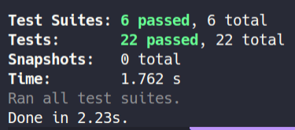

# Desafio 02 - Trabalhando com middlewares 

## Requisitos:

Realizar alteração dos Middlewares:

- ✅ **checksExistsUserAccount**: Esse middleware é responsável por receber o username do usuário pelo header e validar se existe ou não um usuário com o username passado. Caso exista, o usuário deve ser repassado para o request e a função next deve ser chamada.

- ✅ **checksCreateTodosUserAvailability**: Esse middleware deve receber o usuário já dentro do request e chamar a função next apenas se esse usuário ainda estiver no plano grátis e ainda não possuir 10 todos cadastrados ou se ele já estiver com o plano Pro ativado.

- ✅ **checksTodoExists**: Esse middleware deve receber o **username** de dentro do header e o **id** de um _todo_ de dentro de `request.params`. Você deve validar o usuário, validar que o `id` seja um uuid e também validar que esse `id` pertence a um _todo_ do usuário informado.

Com todas as validações passando, o _todo_ encontrado deve ser passado para o `request` assim como o usuário encontrado também e a função next deve ser chamada.

- ✅ **findUserById**: Esse middleware possui um funcionamento semelhante ao middleware checksExistsUserAccount mas a busca pelo usuário deve ser feita através do id de um usuário passado por parâmetro na rota. Caso o usuário tenha sido encontrado, o mesmo deve ser repassado para dentro do request.user e a função next deve ser chamada.

## Testes:



## Rotas da aplicação:

**OBS**: O header da aplicação deve conter a propriedade `username`.

- **POST** `/users`: Cria novo usuário.

```js
  {
    name: string,
    username: string,
  }
```

- **GET** `/users/:id`: Busca usuário po id.

- **PATCH** `/users/:id/pro`: Alterar plano do usuário:

```js
{
  pro: true || false;
}
```

- **GET** `/todos`: Lista os todos do usuário.
- **POST** `/todos`: Cria um novo todo.

```js
{
  title: string,
  deadline: 'aaaa/mm/dd',
}
```

- **PUT** `/todos/:id`: Altera um todo existente.

```js
{
  title: string,
  deadline: 'aaaa/mm/dd'
}
```

- **PATCH** `/todos/:id/done`: Marca um todo como feito.

```js
{
  done: true || false;
}
```

- **DELETE** `/todos/:id`: Deleta um todo existente.
